# Digital Filters in Faust

## Preludes to Filter Syntax in Faust

### Constructing a delay line
In FAUST the ```_``` represent a signal input.
A function with one input that goes directly to the output is written as follows: 

https://github.com/LucaSpanedda/Digital_Filters_in_Faust/blob/c25f64f7c165c10aa0ca5c4e0edea73a7aedd898/src/examples.lib#L4-L8
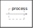

---
where
```process``` is the ***main*** function in Faust (the compiler's output function).
And 
```import("stdfaust.lib");``` is the function for import the Standard Faust Libraries.
---

Faust provides us with three different syntaxes to express a delay line:

- ```'``` - is used to express a one sample delay. Time expressions can be chained, so the output 
  signal of this program

  https://github.com/LucaSpanedda/Digital_Filters_in_Faust/blob/c25f64f7c165c10aa0ca5c4e0edea73a7aedd898/src/examples.lib#L10-L11
  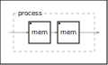

  will produce a delayed signal of two samples.
  
  ---

- ```mem``` - indicates a 1 sample delay. You can use the "mem" successively add delay samples, so 
  the output signal of this program

  https://github.com/LucaSpanedda/Digital_Filters_in_Faust/blob/c25f64f7c165c10aa0ca5c4e0edea73a7aedd898/src/examples.lib#L13-L14
  
  will produce a delayed signal of two samples.
  
  These last two programs produce the same result.

  ---

- ```@``` - indicates a number of variable delay samples, so for example a signal with 192000 
  samples of delay is written like:
  
  https://github.com/LucaSpanedda/Digital_Filters_in_Faust/blob/c25f64f7c165c10aa0ca5c4e0edea73a7aedd898/src/examples.lib#L16-L17
  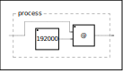
  
### Dirac impulse
Now, another element that we can introduce through the filter syntax is the Dirac impulse, 
which represents our minimum DSP unit, namely the single sample
by putting a number 1 and subtracting the same value from it
but doing it at a delayed sample.

Example:

https://github.com/LucaSpanedda/Digital_Filters_in_Faust/blob/c25f64f7c165c10aa0ca5c4e0edea73a7aedd898/src/examples.lib#L19-L21
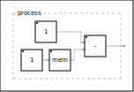

or something like that using functional syntax:

https://github.com/LucaSpanedda/Digital_Filters_in_Faust/blob/c25f64f7c165c10aa0ca5c4e0edea73a7aedd898/src/examples.lib#L23-L25

These last two programs produce the same result.

### Methods for Implementing Recursive Circuits in the Faust Language

Now we will illustrate three main methods for Implementing Recursive Circuits in FAUST Language:

- Writing the code line with internal recursion:
  
  in this way *tilde* ```~``` operator sends the signal
  output to itself, to the first available input
  creating a feedback circuit.
  
  One way to force the operator to point to a certain point
  in the code, is to put parentheses ```()```, in this way ```~```
  will point to the input before the parenthesis.

  In this program, the input is summed with itself delayed by one sample and multiplied by 0.5:
  
  https://github.com/LucaSpanedda/Digital_Filters_in_Faust/blob/c25f64f7c165c10aa0ca5c4e0edea73a7aedd898/src/examples.lib#L27-L28
  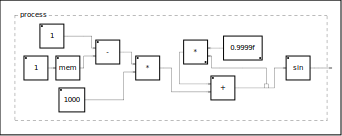

  ---
  
- Using the with construction ```with{};```:

  It can be used to create a local enviroment.
  You can define a function in which are passed
  the various arguments of the function that control
  the parameters of the code,
  and say that that function is equal to
  exit from the with, with ```~ _```.
  You can find an exhaustive explanation of [with construction here](https://faustdoc.grame.fr/manual/syntax/index.html#with-expression)
  
  Example:
  
  https://github.com/LucaSpanedda/Digital_Filters_in_Faust/blob/c25f64f7c165c10aa0ca5c4e0edea73a7aedd898/src/examples.lib#L30-L38
  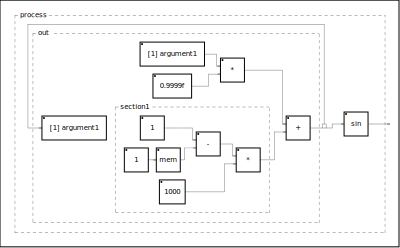

  Moreover, with in Faust allows declaring variables
  that are not pointed to from outside the code but only
  from the belonging function; in this case
  the function to which with belongs is "function_with".

  ---

- A third method is to use the letrec environment.
  
  with this method we can write a signal
  recursively, similar to how
  recurrence equations are written.
  
  https://github.com/LucaSpanedda/Digital_Filters_in_Faust/blob/c25f64f7c165c10aa0ca5c4e0edea73a7aedd898/src/examples.lib#L40-L52
  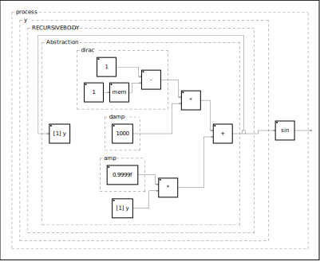

---

Concluding this chapter on filter syntax in FAUST, we need to introduce a fundamental concept that will help us gain a more comprehensive understanding of digital filters: the relationship between milliseconds and samples -> sampling frequency.

## Milliseconds - Samples and the importance of the sampling frequency
Digital filters differ from analog filters for one particular reason: the Analog-to-Digital (AD) conversion system involves discretizing a continuous physical phenomenon into a sampled numerical one.
Understanding the relationship between time and samples helps us in reasoning and practical applications of digital filters. These filters indeed entail spectral changes (when observed in the frequency domain) and involve temporal integration changes (when observed in the time domain).
This brief preamble will be explained further in the chapter on the bilinear transform. For now, let's focus on small examples of converting between milliseconds and samples.

### Conversion from Milliseconds to Samples

This program takes input time expressed in milliseconds 
and returns the value in samples.

https://github.com/LucaSpanedda/Digital_Filters_in_Faust/blob/c25f64f7c165c10aa0ca5c4e0edea73a7aedd898/src/examples.lib#L54-L57
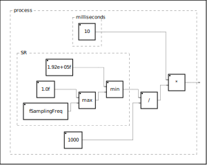

Through ```ma.SR```, we use the current sampling frequency of 
the machine we are using.

For example, if we have a sampling frequency 
of **96000** samples per second, 
it means that 1000ms (1 second) is represented
by **96000 parts**, and therefore **a single unit
of time** like 1ms **corresponds** digitally to **96 samples**.

For this reason, we divide the sampling frequency
by 1000ms, resulting in a total number of samples
that corresponds to 1ms in the digital world at 
a certain sampling frequency.

And then we multiply the result of this operation
by the total number of milliseconds we want to obtain as 
a representation in samples.
If we multiply by 100 we will have
**9600 samples every 100ms** at a sampling frequency 
of 96000 samples per second.

### Conversion from Samples to Milliseconds

Function for Conversion from Samples to Milliseconds:
we input a total number of samples,
of which we need to know the overall duration
in milliseconds based on our sampling frequency.

We know that a sampling frequency
corresponds to a set of values that express 
together the duration of 1 second (1000 ms).

It means, for example,
that at a sampling frequency of 48,000
samples per second, 
1000 milliseconds are represented by 48,000 parts.
So if we divide our 1000ms. / 
into the 48,000 parts which are the samples of our system,
we would get the duration in milliseconds of a single sample
at that sampling frequency,
in this case therefore: 
1000 / 48,000 = 0.02ms. 
And so the duration in milliseconds of a single sample at 48,000
samples per second, is 0.02 milliseconds.
If we multiply the obtained number *
a total number of samples, we will get the time in milliseconds
of those samples for that sampling frequency used.

Obviously, as can be deduced from the considerations,
as the sampling frequency increases,
the temporal duration of a single sample decreases,
and thus a greater definition.

## Phase Alignment of Feedback

We need to spend a few words about the implementation of a delay line in feedback in the digital world.

In the following program, we have a Dirac impulse that is summed by itselfs delayed by 2 samples.

https://github.com/LucaSpanedda/Digital_Filters_in_Faust/blob/c25f64f7c165c10aa0ca5c4e0edea73a7aedd898/src/examples.lib#L59-L60
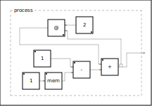

We expect these values to appear in the first 10 samples:

| nth sample |   value 	 |
|------------|-----------|
|      0     |	   1	 |	
|      1     |	   0	 |
|      2     |	   1	 |
|      3     |	   0	 |
|      4     |	   1	 |
|      5     |	   0	 |
|      6     |	   1	 |
|      7     |	   0	 |
|      8     |	   1	 |
|      9     |	   0	 |

However, the results of the data plot are as follows:

| nth sample |   value 	 |
|------------|-----------|
|      0     |	   1	 |	
|      1     |	   0	 |
|      2     |	   0	 |
|      3     |	   1	 |
|      4     |	   0	 |
|      5     |	   0	 |
|      6     |	   1	 |
|      7     |	   0	 |
|      8     |	   0	 |
|      9     |	   1	 |

There's something wrong. With each feedback cycle, it's being delayed by one extra sample!
That's because in the digital domain, the feedback of a 
delay line, when applied, costs by default one sample delay.

'*Feedback = 1 Sample*'

So one must consider that the number of delay samples equals the number of samples minus 1:

https://github.com/LucaSpanedda/Digital_Filters_in_Faust/blob/c25f64f7c165c10aa0ca5c4e0edea73a7aedd898/src/examples.lib#L62-L64


---

In some application scenarios later on, we'll need a one-sample delay even at the input signal. 
In this case, simply concatenating a delay line in series will suffice.

https://github.com/LucaSpanedda/Digital_Filters_in_Faust/blob/c25f64f7c165c10aa0ca5c4e0edea73a7aedd898/src/examples.lib#L66-L68
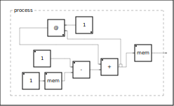

## Digital Filters

### ONEZERO FILTER (1st Order FIR)

```_``` represents the input signal, (```_``` denotes the signal)
    it is then split into two parallel paths ```<:``` 
    one delayed by one sample ```_'``` (```'``` denotes one sample delay)
    and one without delay, ```_``` (```,``` denotes transition to the second path)
    they are then summed into a single signal ```:> _ ;```
    the delayed signal has a feedforward amplitude control ```* feedforward```
    there is a general amplitude control ```* outgain```
    on the output function onezeroout
    
https://github.com/LucaSpanedda/Digital_Filters_in_Faust/blob/50e95f55faeda375528a3362a5074a53e76b4a3c/src/filters.lib#L7-L9
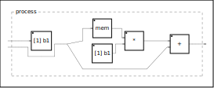

### ONEPOLE FILTER (1st Order IIR)

```+ ~``` is the summation, and the feedback 
    of the arguments inside parentheses ```()_``` represents the input signal, (```_``` denotes the signal)
    delayed by one sample ```_``` (automatically in the feedback)
    which enters : into the gain control of the ```feedback * 1-feedback```
    the same feedback controls the input amplification
    of the signal not injected into the feedback
    there is a general amplitude control ```* outgain```
    on the output function onezeroout

https://github.com/LucaSpanedda/Digital_Filters_in_Faust/blob/50e95f55faeda375528a3362a5074a53e76b4a3c/src/filters.lib#L11-L13
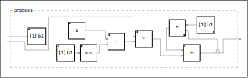

and OPF with Frequency Cut transfer functions:

(1)
https://github.com/LucaSpanedda/Digital_Filters_in_Faust/blob/50e95f55faeda375528a3362a5074a53e76b4a3c/src/filters.lib#L23-L29
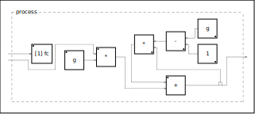
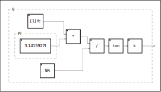
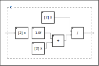

(2)
https://github.com/LucaSpanedda/Digital_Filters_in_Faust/blob/50e95f55faeda375528a3362a5074a53e76b4a3c/src/filters.lib#L31-L35
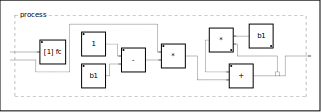
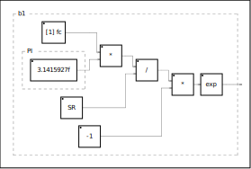

same OPF with Formulae expressed in Seconds (1 / FC)

(3)
https://github.com/LucaSpanedda/Digital_Filters_in_Faust/blob/50e95f55faeda375528a3362a5074a53e76b4a3c/src/filters.lib#L37-L43

### FEEDFORWARD COMB FILTER (Nth Order FIR)

```_``` represents the input signal, (```_``` denotes the signal)
    it is then split into two parallel paths ```<:``` 
    one delayed by ```@(delaysamples)``` samples
    (thus value to be passed externally)
    and one without delay, ```_``` (```,``` denotes transition to the second path)
    they are then summed into a single signal ```:> _ ;```

the delayed signal has a feedforward amplitude control ```* feedforward```

there is a general amplitude control ```* outgain```
on the output function onezeroout

https://github.com/LucaSpanedda/Digital_Filters_in_Faust/blob/50e95f55faeda375528a3362a5074a53e76b4a3c/src/filters.lib#L48-L50
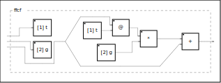

### FEEDBACK COMB FILTER (Nth Order IIR)

```+ ~``` is the summation, and the feedback 
	of the arguments inside parentheses ```()
    _``` represents the input signal, (```_``` denotes the signal)
    delayed by ```@(delaysamples)``` samples 
    (thus value to be passed externally)
    which enters : into the gain control of the feedback, ```* feedback```

In the feedback, one sample of delay is already present by default,
hence ```delaysamples-1```.

there is a general amplitude control ```* outgain```
on the output function combfeedbout

https://github.com/LucaSpanedda/Digital_Filters_in_Faust/blob/50e95f55faeda375528a3362a5074a53e76b4a3c/src/filters.lib#L52-L54
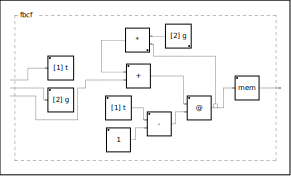

### Lowpass FEEDBACK COMB FILTER (Nth Order IIR)

similar to the comb filter, but within the feedback,
    following the feedback enters the signal : into the onepole.
    The onepole is a lowpass where the cutoff 
    frequency can be controlled between 0. and 1. 
    In the feedback, one sample of delay is already present by default,
    hence ```delaysamples-1```.

https://github.com/LucaSpanedda/Digital_Filters_in_Faust/blob/50e95f55faeda375528a3362a5074a53e76b4a3c/src/filters.lib#L60-L62
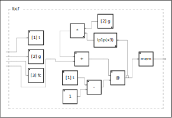


### ALLPASS FILTER

from the sum of a comb IIR and a comb FIR in opposition of phase, emerge a recursive delay unit that preserve the phase of the input signal.  (```+``` transitions : to a cable ```_``` and a split ```<:```
        then ```@delay``` and gain, in ```feedback ~``` to the initial sum.
        filtergain controls the amplitude of the two gain states, 
        which in the filter are the same value but positive and negative,
        one side ```* -filtergain``` and one side ```* +filtergain```.
        In the feedback, one sample of delay is already present by default,
        hence ```delaysamples-1```.
        To maintain the delay threshold of the value delaysamples,
        a mem delay (of the subtracted sample) is added
        at the end.

https://github.com/LucaSpanedda/Digital_Filters_in_Faust/blob/50e95f55faeda375528a3362a5074a53e76b4a3c/src/filters.lib#L56-L58
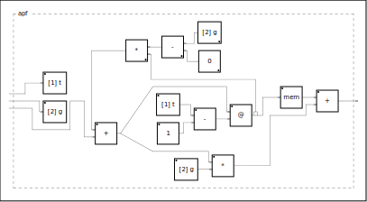

### MODULATED ALLPASS FILTER

Allpass Filter with Time-Variant delay

https://github.com/LucaSpanedda/Digital_Filters_in_Faust/blob/50e95f55faeda375528a3362a5074a53e76b4a3c/src/filters.lib#L321-L332

### STATE VARIABLE FILTER (SVF)

State variable filters are second-order RC active filters consisting of two identical op-amp integrators with each one acting as a first-order, single-pole low pass filter, a summing amplifier around which we can set the filters gain and its damping feedback network. The output signals from all three op-amp stages are fed back to the input allowing us to define the state of the circuit.

The state variable filter is a type of multiple-feedback filter circuit that can produce all three filter responses, Low Pass, High Pass and Band Pass simultaneously from the same single active filter design, and derivation like Notch, Peak, Allpass...

### Robert Bristow Johnson's SVF Biquad

This filter transfer functions were derived from analog prototypes (that
are shown below for each EQ filter type) and had been digitized using the
Bilinear Transform by Robert Bristow-Johnson: https://webaudio.github.io/Audio-EQ-Cookbook/audio-eq-cookbook.html

https://github.com/LucaSpanedda/Digital_Filters_in_Faust/blob/50e95f55faeda375528a3362a5074a53e76b4a3c/src/filters.lib#L141-L239
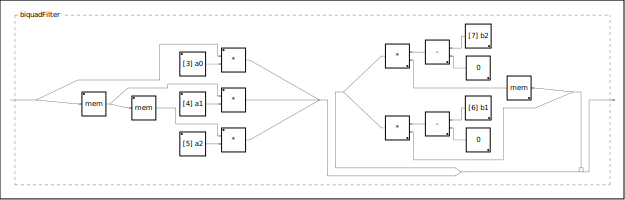

### ONEPOLE Topology Preserving Transforms (TPT)

TPT version of the One-Pole Filter by Vadim Zavalishin
reference: 
https://www.native-instruments.de/fileadmin/redaktion_upload/pdf/KeepTopology.pdf

the topology-preserving transform approach, can be considered as
a generalization of bilinear transform, zero-delay feedback and trapezoidal integration methods. This results in digital filters having nice amplitude and phase
responses, nice time-varying behavior and plenty of options for nonlinearities

https://github.com/LucaSpanedda/Digital_Filters_in_Faust/blob/50e95f55faeda375528a3362a5074a53e76b4a3c/src/filters.lib#L246-L263

### Vadim Zavalishin's SVF Topology Preserving Transform

https://github.com/LucaSpanedda/Digital_Filters_in_Faust/blob/50e95f55faeda375528a3362a5074a53e76b4a3c/src/filters.lib#L69-L101
